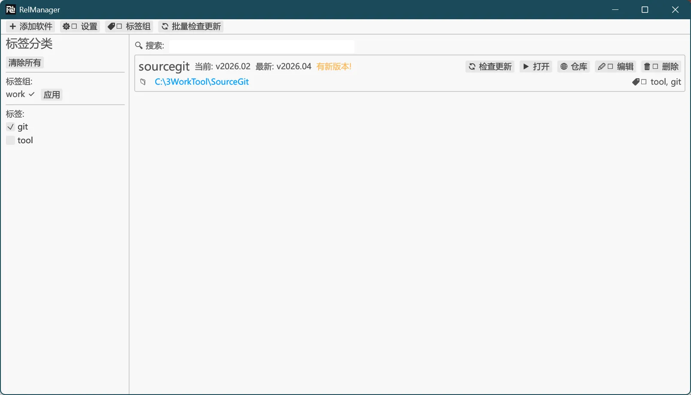

# RelManager

RelManager 是一款window下的标签化软件管理程序，并提供对 GitHub Release 软件的更新检查。

## 截图
<div align="center">
  
</div>

## 功能特性

- **软件库管理**：
	- 软件列表，展示软件如别名、版本、路径、备注和标签等信息，并支持快速运行、编辑信息、打开仓库、检查更新等操作。
- **标签与标签组**：
  - 支持多标签筛选，可为软件添加任意标签。
  - 可创建标签组，一键应用组内所有标签。
- **github软件添加**：
  - 在添加软件时，可输入 GitHub 仓库链接，获取仓库release列表，可选择版本和软件包，显示下载链接（可复制或直接在浏览器中打开）。
  - 进入编辑软件信息界面时，会自动填充仓库、版本信息。

- **github更新检测**：
  - 手动批量检查所有软件更新，或对单个软件进行更新检查。（仅配置github 仓库链接的软件会检查）
  - 自动定时检查（可设置间隔），后台运行并在发现更新时通知用户。
  - 检测到新版本时自动更新软件的最新版本，并在界面中高亮显示。
  - 可在设置中输入个人访问令牌，提高 API 调用限额（默认匿名每小时 60 次）。

## 下载运行
在release中可以下载最新版本的软件exe。
运行会在文件目录创建 `data.db` 数据库文件。

## 使用方法

1. **添加软件**：
   - 点击主窗口顶部的“➕ 添加软件”按钮。
   - 输入 GitHub 仓库链接（如 `https://github.com/owner/repo`），点击“获取 Releases”。
   - 选择版本和资产， 会给出对应的下载链接。
   - 手动下载安装完成后点击下一步。
   - 填写软件信息（别名、安装路径、可执行文件等），点击“完成”保存。
   - 对于非github软件可点击“直接编辑”跳过github步骤，直接填写信息。

2. **检查更新**：
   - 点击“🔄 批量检查更新”检查所有软件。
   - 或点击每个软件卡片右侧的“🔄 检查更新”单独检查。
   - 检查过程中会显示“正在检查”弹窗，完成后显示结果。

3. **标签管理**：
   - 在左侧标签面板可多选标签进行筛选。
   - 点击“🏷️ 标签组”可创建/编辑标签组，应用标签组会选中该组所有标签。

4. **编辑/删除**：
   - 点击卡片上的“✏️ 编辑”修改软件信息。
   - 点击“🗑️ 删除”后需确认删除操作。

5. **设置**：
   - 点击“⚙️ 设置”可配置 GitHub Token、自动检查间隔和下载目录（暂未集成下载功能）。

6. **打开链接/路径**：
   - 点击“🌐 仓库”在浏览器中打开 GitHub 仓库。
   - 点击安装路径可打开文件夹，点击“▶ 打开”启动已配置的可执行文件。

## 配置

- **GitHub Token**：在设置中输入，用于提高 API 速率限制（需 `repo` 或 `public_repo` 权限）。
- **自动检查间隔**：以小时为单位，设为 0 禁用自动检查。
- 所有设置保存在数据库的 `settings` 表中。

## 技术栈

- **GUI 框架**：[egui](https://github.com/emilk/egui) + [eframe](https://github.com/emilk/egui/tree/master/crates/eframe)
- **数据库**：[SQLite](https://sqlite.org/) via [rusqlite](https://crates.io/crates/rusqlite)
- **HTTP 客户端**：[reqwest](https://crates.io/crates/reqwest) (异步)
- **异步运行时**：[tokio](https://tokio.rs/)
- **版本比较**：[semver](https://crates.io/crates/semver)
- **其他**：chrono（时间处理）、serde（序列化）、rfd（文件对话框）等。

## 开发

### 项目结构
```
src/
├── main.rs               # 程序入口
├── app/                  # 核心逻辑
│   ├── mod.rs
│   ├── model.rs          # 数据模型
│   ├── db.rs             # 数据库操作
│   ├── github.rs         # GitHub API 客户端
│   ├── updater.rs        # 更新检测
│   └── platform.rs       # Windows 资产匹配
├── gui/                  # 用户界面
│   ├── mod.rs
│   ├── main_window.rs    # 主窗口
│   ├── add_wizard.rs     # 添加向导
│   ├── edit_dialog.rs    # 编辑对话框
│   ├── settings_window.rs # 设置窗口
│   ├── tag_group_manager.rs # 标签组管理
│   └── widgets.rs        # 自定义组件
└── utils/                # 工具函数
    ├── mod.rs
    ├── path.rs           # 路径处理
    └── version.rs        # 版本比较
```


## 📄 许可证
Apache License 2.0
